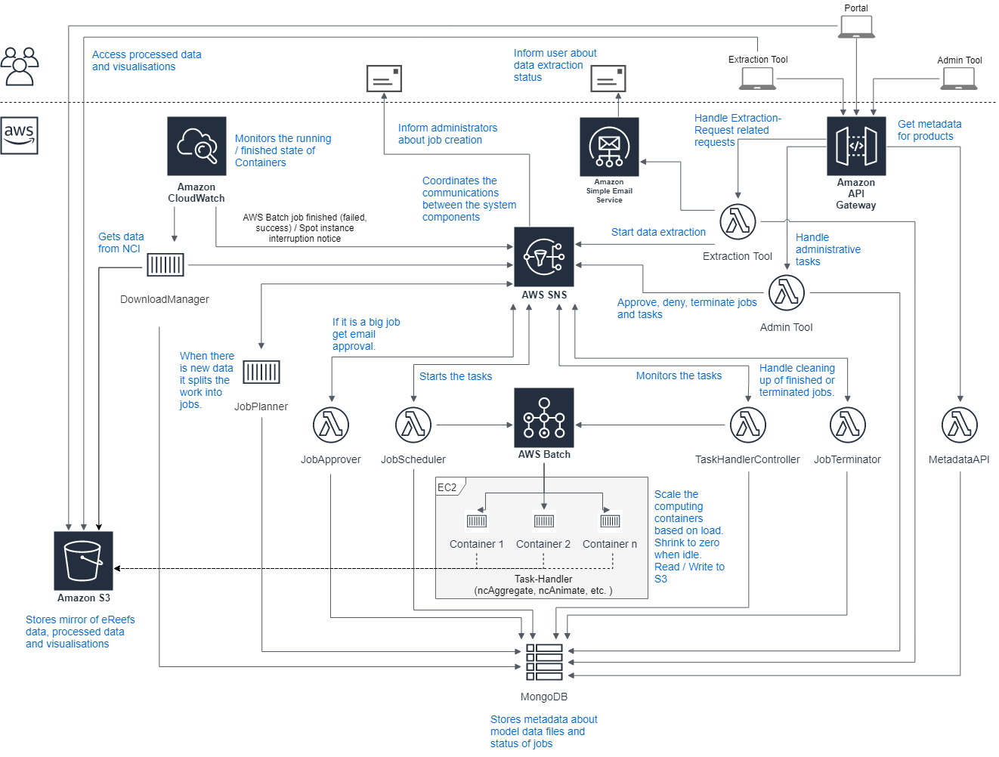

AIMS eReefs Visualisations and aggregations platform
====================================================

This repository provides an access point into the code associated with the [AIMS eReefs platform](https://ereefs.aims.gov.au/). 
This platform provides access to visualisation and aggregation products derived from the eReefs suite of hydrodynamic and 
biogeochemical models of the Great Barrier Reef.

eReefs is a collaboration between the [Great Barrier Reef Foundation](https://www.barrierreef.org/),
[CSIRO](https://www.csiro.au/), the [Australian Institute of Marine Science](https://www.aims.gov.au/), 
[Bureau of Meteorology](http://www.bom.gov.au/), and [Queensland Government](https://www.qld.gov.au/). It aims to 
develop a platform that will provide a picture of what is currently happening on the reef.

The AIMS eReefs Visualisation Platform is developed and maintained by the [Australian Institute of Marine Science](https://www.aims.gov.au/).

For more information about eReefs generally, please visit the project website [https://www.ereefs.org.au/](https://www.ereefs.org.au/). 
For more information about the visualisation portal, please visit [the About page](https://ereefs.aims.gov.au/ereefs-aims/about).

## Table of contents
- [Background](#background)
- [AIMS eReefs Platform Overview](#ereefs-platform-overview)
- [Repositories](#repositories)
- [Technical Overview](#technical-overview)
- [SNS Topics and messages](#sns-topics-and-messages)
- [Object definitions](#object-definitions)
    - [Job](#job)
    - [Task](#task)
    - [Extraction-Request](#extraction-request)
- [Status descriptions](#status-descriptions)
    - [Job status](#job-status)
    - [Task status](#task-status)
    - [Extraction-Request status](#extraction-request-status)
- [Infrastructure](#infrastructure)

## <a name="background"></a>Background
eReefs has many components developed and maintained by each of the organisations in the collaboration, including catchment 
modelling (Queensland Government), remote sensing (BOM and CSIRO), hydrodynamic modelling (BOM and CSIRO) and biogeochemical 
modelling (CSIRO). AIMS's contribution is to provide data aggregation and visualisation services. Figure 1 shows an overview 
of the major components of eReefs. The AIMS eReefs platform generates its products based on eReefs model data provided by
CSIRO, which are driven from boundary data from BOM and DES (Queensland Government).
In simple terms, the *boundary data* serves as a specialised input dataset for the model, containing information solely
at the edges of the model's coverage area. This data, along with other inputs, enables the model to simulate conditions
throughout the entire managed region. **JJ: It's not clear what the boundary 
data is or why it's required. Either explain here or link to more information - GL: I added a sentence just before this comment.
I'm not entirely sure if that clarifies it or adds confusion. We could simply remove reference to the boundary data. I don't think it's necessary.
It might help to understand how the model works, but that's not really our goal here.**
Both CSIRO and BOM provide some additional
visualisation websites. Each of the eReefs website are accessible from the [eReefs website](https://ereefs.org.au/).
**JJ: why not link to them here? - GL: Because URLs are not always well maintained. They can change without providing redirection.
Also, it's not what we do, it's just a quick reference to what they do.** This
repository focuses on the [AIMS eReefs Platform](https://ereefs.aims.gov.au/) which provides visualisations of the eReefs
models as animated multi-panel map videos that show the relationships between variables in the models. Figure 1 below show 
how the data flows between different services that make up the eReefs platform. The AIMS eReefs Platform is represented by the 
more saturated blue box in the figure below.


*Figure 1. Overview of the data workflow in eReefs.*

## <a name="ereefs-platform-overview"></a>AIMS eReefs Platform overview
Figure 2 shows a conceptual overview of the data workflow that occurs in the AIMS eReefs Platform. A more technical overview is provided [in a later section](#technical-overview). Model data is pushed
from CSIRO models to the National Computing Infrastructure (NCI) THREDDs data services.

The data repository is checked daily for changes. The [DownloadManager](https://github.com/open-AIMS/ereefs-download-manager)
automatically downloads new or modified files to a mirror on Amazon S3 and notify the system when files are downloaded.
**GL: I rephrased that sentence, using the text I wrote for the private doc overview**
The downloaded files are checked for file corruptions and passed through an NcAggregate preprocessing stage to trim out unwanted variables 
and depths from the data. **JJ: does this mean we aren't processing all available data? If so, might be good to explain why -
GL: The eReefs model outputs TB of data. We only generate visualisation for what we consider interesting.
There is no point generating GB of videos to show temperature or current at a depth of 4km.
The output files also contain several functional variables, which are required by the model, but are not useful to the public** 
This significantly shrinks the size of the mirror that must be maintained, leading to significant
cost savings, and a reduction in the size of S3 downloads needed for subsequent processing stages. Details of the products already
processed are recorded in a central database. **JJ: why record these? Does something else do the processing,
or do we add the products to the database as we process them? -
GL: S3 keeps very little file metadata. We register metadata such as last modified date, downloaded date, file status (valid, corrupted, etc),
NetCDF variable and dimensions extents, file checksum, etc. The system needs that info to know if the file needs to be re-downloaded, re-processed, ignored, etc.
The system needs to know what have changed in order to know what needs to be done (i.e. re-generated).
All metadata info is stored in DB. We also store NetCDF variable info because getting those from a DB only takes a few milliseconds.
Getting it from the file itself takes about 5 minutes (the file needs to be downloaded for the info to be extracted)**

The trimmed mirror model data is then processed by NcAggregate to calculate temporal aggregate products and other derived
exposure products. Each of these processes pulls data from the S3 mirror then saves the derived data back to S3. Each of the
aggregate products include a regridding of the raw model data from a curvilinear grid into a regular rectangular grid. This
increases the file sizes slightly, but allows the data files to then be subsequently read by Desktop GIS applications.

Visualisations of the trimmed mirror model data and the derived aggregation products are created using NcAnimate.
This is configured to generate individual maps of aggregation products or a time series of maps in video format. All the 
visualisation products are stored in S3 and a record of their details is saved in the central database. **JJ: I assume this is the 
same central database referenced earlier. It would be good to link to more information about this database. -
GL: Yes, same database. I'm not sure if we should add a link to the repo, since the database server is defined in the ereefs-definitions project.
That project contains quite a lot of stuff, not just the definition of the DB.** These visualisations are made
available on the individual product pages (see [example](https://ereefs.aims.gov.au/ereefs-aims/gbr4/temp-wind-salt-current)), through a custom Drupal module that provides 
the User Interface to navigate through the time series of visualisation
products. This Drupal module discovers the listing and details of all the visualisations through a server side JSON service,
the [eReefs metadata API](https://github.com/aims-ks/ereefs-metadata-api), that 
allows queries against the central Database. **JJ: this needs link to details about the JSON service. - GL: I added a link to the project repo**

Users can download the data through two different options: utilising the THREDDS service for the NetCDF file download,
or they can use the Data extraction tool to easily retrieve a subset of the data in a user-friendly CSV format.
The Data extraction tool consists of a JavaScript web GUI application that talks to backend services.
When a user file a data extraction request, it triggers NcAggregate to generate timeseries extractions of datasets.
The final extractions are stored in S3 and an email is sent to the user, with a link to download the data.
**JJ: what Data extraction tool? The tool needs some preamble about its purpose - GL: Yes, that was added later and it feels disconnected. I re-phrased the whole paragraph.**


*Figure 2. Overview of the AIMS eReefs Platform*

### Breaking processing into Jobs
The processing workload on the system tends to happen in bursts. Processing is needed each day as updates to the model data
become available. This processing is triggered from daily checks. **JJ: in addition to these daily checks?**, the extraction tool triggers processing when a user submits
an extraction job. When the eReefs models are updated, all the derived data and visualisation products need to be regenerated,
trigging a massive workload. 
A group of tasks that relate to a particular action (such as processing new data, or regenerating derived data and visualisations), it known as a Job. **JJ: I have added the previous sentence base on what I can gather about Jobs. Please change if incorrect.**
The coordination of the tasks that make up a Job is performed by [JobPlanner](https://github.com/aims-ks/ereefs-job-planner). It translates the requests 
(perform an aggregation, check for new model data) into jobs that need to be performed. This section provide a short overview of [JobPlanner](https://github.com/aims-ks/ereefs-job-planner). More information can be found in [the Github repository](https://github.com/aims-ks/ereefs-job-planner).

Originally the AIMS eReefs Platform was developed using a conventional single server architecture, where all the storage and
processing software were linked to a single large server (see Figure 3). This approach minimised the software complexity, but
resulted in inefficient infrastructure utilisation. The server needed to be large enough to cope with the peak demands of the
service, which lead to significant idle time (~90%) and the conventional network (AWS EBS) hard disks needed to precommit to 
a certain amount of storage, leading to unused space most of the time and the hassle of migrating data to progressively
larger and larger disks each 6 - 12 months. 

The AIMS eReefs Platform was reengineered to take advantage of scalable cloud architecture from 2018 - 2020 (see Figure 3).
In this approach all persistent storage uses S3 object storage. This allows multiple servers to access the
data files concurrently. The processing tasks are split into Jobs, each corresponding to a set of tasks (e.g. 
update an animation product, perform a data extraction). Each of these tasks are then performed by either 
`NcAnimate` or `NcAggregate` running in a Docker container on a pool of servers. The number
of active servers is actively managed by AWS Batch. As each Docker container is started it checks the central database (MongoDB)
for details of the task to be run. As the Job executes it pulls data from S3 and saves its results back to S3 storage, and
updates the central database of its status.


*Figure 3. Overview of the scalable cloud architecture of the AIMS eReefs platform.*

### Robust job execution and AWS Spot Instances
The AIMS eReefs Platform uses features of the AWS cloud infrastructure to dynamically adapt the 
number of active servers based on the current load. **JJ: which AWS service manages this?** When all processing is complete the number of active servers shrinks to
a few small servers that maintain the always on services (database and the THREDDS). This dynamic scaling of services significantly
reduces the server costs of the system as it allows high peak computing performance without needing to pay for idle servers during
quiet periods. Additionally, the system is robust to server failures, so that if a job to process a given data or visualisation
product fails due to a server outage then these jobs will be retried on a new server. This robust approach allows us to use
AWS spot instance servers. Spot instances correspond to surplus uncommitted servers in the AWS infrastructure. These servers are priced
60 - 70% cheaper normal server prices, but have the disadvantage that they can be reclaimed by AWS with only 2 minutes notice should 
a customer wish to use the server. To use these servers the computing architecture needs to be robust against these outages. In
the AIMS eReefs Platform all servers are hosted on AWS spot instances. If any of the active servers are recalled by AWS then a
new spot instance is fired up to take over the lost server. This happens for the database and THREDDS servers, resulting in small
outages (typically 5 min). For processing jobs when the server is recalled the uncompleted jobs are re-issued the next time the 
[JobPlanner](https://github.com/aims-ks/ereefs-job-planner) is triggered.

## <a name="progressive-open-source"></a>Progressive Open Source
The complete AIMS eReefs Platform is described in code with all software components described in Git repositories and
the cloud infrastructure described using CloudFormation infrastructure code. It is our intention to make the full source
of the platform available as open source. 

Cloud based architectures involve a lot of interconnected services that rely on complex authentication processes to allow
these services to talk with each other. This complexity introduces significant potential security risks to the AIMS eReefs Platform
infrastructure if any of the authentication keys are accidentally included in the source code then released openly.

For this reason each of the platform code repositories will be released openly only after they have undergone a security review 
to ensure they contain no sensitive information.

Initially the eReefs Download Manager, NcAggregate and NcAnimate were released, along with any dependant libraries. These
represent the components most likely to be useful as stand-alone tools. Each of these tools can be run locally without the
need for the full AWS cloud infrastructure as command line tools. This command line capability was developed to facilitate
testing of these components. 


## <a name="repositories"></a>Repositories  

The project was divided in subprojects to make it easier to develop and maintain.
Each part of the system is specialised in resolving a single task.
This documentation repository provides links and introductory documentation for all the AIMS eReefs Platform code repositories,
including those which have not been released publicly yet (as they are still undergoing a security review). All the repositories
hosted from the `open-AIMS` account are openly available. Those hosted from the `aims-ks` account are still private.

If you wish to access any of the repositories that are still private then please contact us, and we can potentially
set you up as a collaborator.

- **Documentation** (this repository)  
Link: https://github.com/open-AIMS/ereefs-documentation  
The "documentation" repository holds information about which components make up the eReefs system and describes shared
domain objects. It is intended as an introduction documentation giving an overview without going into details. For more 
technical information see the relevant component documentation.
- **Virtual Machine**  
Link: https://github.com/aims-ks/ereefs-vm  
Provisions a partial instance of the eReefs Platform locally to support local development and testing of other eReefs 
projects. This infrastructure is provisioned on a Linux-based operating environment. Windows-based developers can use a 
virtual machine (this project supports `VirtualBox` provisioned by `Vagrant`) to provide the required Linux-based OS.
- **Definitions**  
Link: https://github.com/aims-ks/ereefs-definitions  
This repository contains the AWS CloudFormation definitions for the shared infrastructure like VPC and SNS
topics and scripts and configurations for initialising the system. It also contains the definitions (processing 
instructions) for the products generated by `ncAggregate` and `ncAnimate`.
- **DownloadManager**  
Link: https://github.com/open-AIMS/ereefs-download-manager  
A Java-based utility responsible for downloading NetCDF files from THREDDS catalogues sources (such as the eReefs NCI 
server), extracting the metadata from the files for population of the central database, and uploading the files to S3.
- **JobPlanner**  
Link: https://github.com/aims-ks/ereefs-job-planner  
A Java-based utility responsible for populating a `Job` with a list of `Tasks` identifying the work to be performed by 
the eReefs Platform. Each `Task` represents a single unit of work to be performed by a single "Task Handler", such as
[ncAggregate](https://github.com/open-AIMS/ereefs-netcdf-aggregator), 
[ncAnimate](https://github.com/open-AIMS/ereefs-ncanimate2), or
[Collector](https://github.com/aims-ks/ereefs-collector).
- **JobApprover**  
Link: https://github.com/aims-ks/ereefs-job-approver  
The `JobApprover` checks the processing size of newly created `Jobs` and either automatically approves it or triggers an 
email informing the administrators about the necessary manual approval or denial.  
- **JobScheduler**  
Link: https://github.com/aims-ks/ereefs-job-scheduler  
The `JobScheduler` is triggered either when a new `Job` is approved or when a `Task` has finished. It submits `Tasks` to
AWS Batch for execution based on the interdependencies of the `Tasks` as identified by `JobPlanner`.
- **TaskHandlerController**  
Link: https://github.com/aims-ks/ereefs-task-handler-controller  
When a container starts processing a `Task` the `TaskHandlerController` updates the `Task` status in the database. It 
also terminates the AWS Batch job when an administrator requests a `Job` or `Task` termination.
- **JobTerminator**  
Link: https://github.com/aims-ks/ereefs-job-terminator  
The `JobTerminator` handles all the `Job` and `Task` status changes regarding termination and finishing.
- **AdminUI**  
Link: https://github.com/aims-ks/ereefs-admin-ui  
The `AdminUI` provides a user interface for administrators to manage `Jobs`, `Tasks` and `Extraction-Requests`. The 
management processes include `approve-job` or `terminate-task`.
- **AdminBackend**  
Link: https://github.com/aims-ks/ereefs-admin-backend  
The `AdminBackend` handles requests from the `AdminUI` by providing endpoints via AWS API Gateway. 
- **ncAggregate**  
Link: https://github.com/open-AIMS/ereefs-netcdf-aggregator  
A Java-based utility responsible for temporal aggregation and related processing within the AIMS eReefs platform. Upon 
execution, `ncAggregate` performs a `Task` created by [Job Planner](https://github.com/aims-ks/ereefs-job-planner) in 
conjunction with the corresponding `Product Definition` specified in 
[eReefs Definitions](https://github.com/aims-ks/ereefs-definitions).
- **Collector**  
Link: https://github.com/aims-ks/ereefs-collector  
A Java-based utility responsible for collecting summary/CSV files created by other `TaskHandlers` (namely
[ncAggregate](https://github.com/open-AIMS/ereefs-netcdf-aggregator)) and compiling them into a 
single output file.
- **ncAnimate**  
Link: https://github.com/open-AIMS/ereefs-ncanimate2  
A Java-based utility responsible for generating visualisation products such as videos and maps.
Its input files are constituted of NetCDF files, EDAL colour palettes, GeoJSON layers, CSV layers, SLD style file
and JSON configuration files which can be stored in a document database such as MongoDB.
It is triggered by the `JobScheduler`. Since determining what file need to be generated or re-generated
is not trivial, the `JobScheduler` simply triggers each ncAnimate task every time.
If a task does not require the generation of visualisation output files, the task simply terminate with success status.
If files need to be re-generated, it divides the task into manageable chunks which are sent to `ncAnimate frame`.
When `ncAnimate frame` has generated all the frames required to generate a video, `ncAnimate` generate the video and
uploads it to `S3`. It does the same with the maps. When a frame is no longer required,
`ncAnimate` deletes it to make more disk space for future frames.
- **ncAnimate frame**  
Link: https://github.com/open-AIMS/ereefs-ncanimate2-frame  
The `ncAnimate frame` utility is part of `ncAnimate`. It was created as a work-around for memory leaks in the EDAL 
library; the EDAL library store references to used data into static collections. Those collections are freed each time
`ncAnimate frame` performs it's constrained list of actions and terminates, freeing all memory.
- **POJO Shared Library**  
Link: https://github.com/open-AIMS/ereefs-pojo
A shared library for accessing core eReefs POJOs (plan old Java objects) from a repository. A POJO is an `Entity` (also 
referred to as a `Data Object`) within the system which captures the values of a domain-specific object. This library
provides both file-based (for development and testing) and MongoDB-based (for Production and Test) implementations.
- **Database**  
Link: https://github.com/open-AIMS/ereefs-database  
A shared Java library containing some layers of abstraction to simplify interaction with the Database and S3.
  - The package `au.gov.aims.ereefs.database` contains a basic layer of abstraction over the database.
  - The package `au.gov.aims.ereefs.bean` contains a higher layer of abstraction containing parsed bean object.
  - The package `au.gov.aims.ereefs.helper` contains helper classes which can be used to simplify some operations such
    as creating iterators for bean collections, downloading NetCDF files from S3, combining ncAnimate config files, etc.
- **MetadataAPI**  
Link: https://github.com/aims-ks/ereefs-metadata-api  
The `MetadataAPI` provides an endpoint via AWS API Gateway to access the product metadata. 
- **Thredds**  
Link: https://github.com/aims-ks/ereefs-thredds  
This repository contains scripts to build and deploy a THREDDS Docker container to AWS to serve the produced output 
files.
- **ExtractionToolUI**  
Link: https://github.com/aims-ks/ereefs-extraction-tool-ui  
The eReefs `ExtractionToolUi` is a React web application to let users define an extraction request which is submitted
to the server ([ereefs-extraction-tool-backend](https://github.com/aims-ks/ereefs-extraction-tool-backend)). After 
processing the request, the user is able to download the extracted data.
- **ExtractionToolBackend**  
Link: https://github.com/aims-ks/ereefs-extraction-tool-backend  
The eReefs `ExtractionToolBackend` provides the API for the `ExtractionToolUI` to add and get extraction requests, and 
to send out emails notifying the user when an extraction request has finished processing.


## <a name="technical-overview"></a>Technical Overview  

*Figure 4. Technical overview of the AIMS eReefs Platform infrastructure.* 

The eReefs application is a distributed system using the AWS infrastructure (see Figure 4). The [Definitions](https://github.com/aims-ks/ereefs-definitions) repository contains the code for the deployment of the services. It includes the following: 

- AWS Batch to manage a pool of servers
- AWS S3 persistent storage, facilitates access by multiple servers
- a MongoDB database to track the state of jobs
- AWS Lambda functions to run the coordination code that manages the scalable computing without needing permanently running servers
- SNS messaging to communicate and trigger events between the different computing nodes
- AWS Gateway to handle incoming web requests

Bigger components like the `JobPlanner` run in a Docker container on EC2 instances while smaller components run as AWS Lambda 
functions. It uses an event-driven approach using AWS SNS. The custom build components are loosely coupled without direct 
interaction, publishing messages to AWS SNS topics which trigger other components subscribed to it. The message
format is JSON.

S3 is used as a file storage while MongoDB is used as the system database, holding information shared across multiple 
components, e.g. `Job` definitions or `Task` status. AWS Batch is used for scheduling and processing single `Tasks` 
while Amazon CloudWatch triggers the [DownloadManager](https://github.com/open-AIMS/ereefs-download-manager) on a regular basis (via the download-request SNS topic) and pushes notifications (**JJ: to SNS?**) when an AWS Batch job 
either starts processing or finishes. Furthermore, Amazon CloudWatch is set up to push a message to SNS when an Amazon Spot 
Instance is going to be terminated. For managing `Jobs`, `Tasks` and `Extraction-Requests`, administrators can use the 
`AdminTool`. **JJ: where can I find out more about the AdminTool? I can't see it in the Repositories section.** It has a JS user interface which communicates with Amazon API Gateway to process tasks (e.g. `approve-job`).
A further component of the system is the [ExtractionToolUI](https://github.com/aims-ks/ereefs-extraction-tool-ui). This tool provides users with the possibility to specify 
exactly which part of the data (raw eReefs data or aggregations) they are interested in and creates a file for 
downloading. The [ExtractionTool](https://github.com/aims-ks/ereefs-extraction-tool-ui) has a JS front end and communicates with Amazon API Gateway for processing requests.

**JJ: I think this section needs work. The finer details are there but the overall picture is lost. I'm not sure how many different types of events can trigger a Job, but if not too many, I think it would be good to go over the flow of events that lead from the trigger event. As far as I understand there are 3 possible trigger events; 1. new data is published by CSIRO; 2. eReefs models are updated; 3. a custom product is requested through the Extraction Tool. It would be good if that was more clear, and if we could see exactly the flow of events when one of these things happens.**

## <a name="sns-topics-and-messages"></a>SNS topics and messages
One of the core concepts in this application is the AWS SNS service with its topics and messages. They connect the 
components by offering a publisher-subscriber model.  

**JJ: what do the black dots represent?**
**JJ: is CloudWatch-download-manager posting to the download-request topic on a schedule?**


  

Topic                        | Publisher                                                                                           | Subscriber                     | Description
---------------------------- | --------------------------------------------------------------------------------------------------- | ------------------------------ | ---------------------------------------------------------------
`all-download-completed`     | `DownloadManager`                                                                                   | `JobPlanner`                   | The `DownloadManager` publishes a message after all downloads of a `DownloadDefinition` are completed.
`download-completed`         | `DownloadManager`                                                                                   | -                              | The `DownloadManager` publishes a message after each completed download.
`download-request`           | CloudWatch rule `ereefs-download_manager-lambda-sns-listener-rule`                                  | `CloudWatch`                   | CloudWatch periodically publishes a message which triggers the SNS listener Lambda function which then submits a AWS Batch job to run the `DownloadManager`.
`ereefs-administration`      | `JobApprover` `JobTerminator` CloudWatch rule `task-handler-failed` and `spot-instance-terminating` | Email notification             | All messages to inform the administrators are published to this topic.
`extraction-requested`       | `ExtractionTool`                                                                                    | `JobPlanner`                   | When a user requests a data extraction the `ExtractionTool` publishes this message to start the `JobPlanner` to create a new `Job` for this extraction.
`job-approved`               | `JobApprover`                                                                                       | `JobScheduler`                 | This message is published by the `JobApprover` when the `Job` status is set to approved to inform the `JobScheduler`.
`job-approved-by-user`       | `AdminTool`                                                                                         | `JobApprover`                  | This message is published when the user clicks the approval button in the `AdminTool`.
`job-completed`              | `JobTerminator`                                                                                     | `ExtractionTool`               | The `JobTerminator` publishes this message when all `Tasks` of a `Job` are finished. The `ExtractionTool` uses this information to inform the user that they can download the results.
`job-created`                | `JobPlanner`                                                                                        | `JobApprover` `JobTerminator`  | The `JobPlanner` publishes this message when a new `Job` was created.
`job-denied-by-user`         | `AdminTool`                                                                                         | `JobApprover`                  | This message is published when the user clicks the denial button in the `AdminTool`.
`job-failed`                 | `JobTerminator`                                                                                     | `ExtractionTool`               | The `JobTerminator` publishes this message when all `Tasks` of a `Job` are finished and at least one has failed. The `ExtractionTool` uses this information to inform the user that the data extraction has failed.
`job-termination-requested`  | `AdminTool`                                                                                         | `JobTerminator`                | This message is published when the user clicks the terminate button in the `AdminTool`.
`spot-instance-terminating`  | CloudWatch rule `spot-instance-terminating`                                                         | `JobTerminator`                | When a AWS Spot instance is about to terminate it issues a warning notification. This notification is forwarded via the CloudWatch rule to start the `JobTerminator` terminate process so that all `Tasks` currently running can terminate gracefully.
`task-finished`              | `JobScheduler` `TaskHandlerController` `JobTerminator`                                              | `JobScheduler` `JobTerminator` | This message is published to notify the `JobScheduler` that it can check if it can assign a new `Task` and for the `JobTerminator` to check if all `Tasks` have finished and it can update the `Job` status. This message is sent when a `Task` is set to a finished state like `SUCCESS`, `FAILED` or `TERMINATED`. 
`task-handler-finished`      | CloudWatch rule `task-handler-finished`                                                             | `TaskHandlerController`        | When a AWS Batch job enters the status `SUCCESS` or `FAILED` the CloudWatch rule is triggered and publishes a message.
`task-handler-running`       | CloudWatch rule `task-handler-running`                                                              | `TaskHandlerController`        | When a AWS Batch job enters the status `RUNNING` the CloudWatch rule is triggered and publishes a message.
`task-handler-submitted`     | CloudWatch rule `task-handler-submitted`                                                            | `TaskHandlerController`        | When a AWS Batch job enters the status `RUNNING` the CloudWatch rule is triggered and publishes a message.
`task-terminating`           | `JobTerminator`                                                                                     | `TaskHandlerController`        | This message is published by the `JobTerminator` when the administrator requested an assigned or running `Task` to terminate.
`task-termination-requested` | `AdminTool`                                                                                         | `JobTerminator`                | This message is published when the user clicks the terminate-task button in the `AdminTool`.

### <a name="object-definitions"></a>Object definitions
Three of the main objects in the eReefs application are the `Job`, the `Task`, and the `ExtractionRequest`.  

#### <a name="job"></a>Job
The `Job` is the aggregating entity for one or more `Tasks`.  **JJ: please add an example of what tasks might make up a job.**

**JJ: the details of a job are stored in MongoDB?**

Definition:  

Property    | Description
----------- | ------------------------------- 
_id         | unique identifier for the `Job`
createdBy   | which system created the `Job` (by default this will be `JobPlanner`)
status      | the current status of the `Job` (see [Status descriptions](#status-descriptions) for more information)
triggeredBy | which system triggered the `Job` creation. This can either be `OPERATIONAL` or `EXTRACTION_REQUEST`,
history     | a list of descriptions of status changes

**JJ: how does the JobPlanner know what tasks are required to be performed from this information? I can't see a product_id or anything like that.**

Example: **JJ: Is this example the format of the SNS notification or the MongoDB entry?**
```json
{
  "_id": "Job_31ae5173-3345-42c3-87ec-322666e29e2e",
  "createdBy": "JOB_PLANNER",
  "status": "APPROVED",
  "triggeredBy": "OPERATIONAL",
  "history": [
    { "timestamp": "2019-03-28T09:38:55+10:00", "status": "CREATED", "description": "Job created by JobPlanner" },
    { "timestamp": "2019-03-28T09:40:55+10:00", "status": "APPROVED", "description": "Status changed to APPROVED by JobApprover"}
  ]
}
```

### Task
The `Task` is a single step in a `Job`.

Definition:  

Property                              | Description
------------------------------------- | ----------------------------------------------- 
_id                                   | unique identifier for a the `Task`
jobId                                 | the ID of the `Job` this `Task` belongs to
type                                  | the type of the `Task`, e.g. `ncaggregate`.
productDefinitionId                   | the ID of the product definition
status                                | the current status of the `Task` (see [Status descriptions](#status-descriptions) for more information)
history                               | a list of descriptions of status changes
stage                                 | either `operational` or `prototype`, determines on which AWS Batch queue this `Task` should be processed
executionContext.awsBatchJobId        | the AWS Batch job ID when the `Task` is submitted to AWS Batch
executionContext.containerInstanceArn | the ARN of the container instance this `Task` is running on
executionContext.logStreamName        | the AWS CloudWatch log-stream name for accessing the logs belonging to this `Task`
executionContext.retries              | the number of retries left for a `Task` to retry processing when it was interrupted (e.g. through a Spot instance termination)
executionContext.assignToken          | a token generated before submitting the `Task` as a AWS Batch job and saved with the `Task` and as env var to prevent duplicate `Task` processing
dependsOn                             | a list of `Tasks` this `Task` is dependant on 
metadataId                            | the ID of the metadata record
outputUrl                             | URL of the output file for further processing or download
timeInstants                          | an array of objects defining the date/time of the time step in the output file.
region                                | the `region` ID to generate, as defined in `ncAnimate` configuration for the specified `productDefinitionId`. When omitted, `ncAnimate` generate outputs for all regions specified in the product configuration. Only used with task of type `ncanimate`.

Example:
```json
{
  "_id": "AggregationTask_4470cd79-d3d8-440f-9d2a-79071c57c910",
  "jobId": "Job_31ae5173-3345-42c3-87ec-322666e29e2e",
  "type": "AggregationTask",
  "productDefinitionId": "products_definition_id",
  "status": "ASSIGNED",
  "history": [
    { "timestamp": "2019-03-28T09:38:55+10:00", "status": "CREATED", "description": "Task created by JobPlanner" },
    { "timestamp": "2019-03-28T09:39:55+10:00", "status": "ASSIGNED", "description": "Task assigned by JobScheduler" },
    { "timestamp": "2019-03-28T09:39:55+10:00", "status": "RUNNING", "description": "Status changed to RUNNING by TaskHandlerController. Reason: task-handler-running event" }
  ],
  "stage": "operational",
  "executionContext": {
    "awsBatchJobId" : "456789123-28e1-492a-ac88-123456789", 
    "containerInstanceArn" : "arn:aws:ecs:region:123456789:container-instance/82f3ea6d-a95e-4b11-b3de-123456789", 
    "logStreamName" : "dev-test-task-handler/default/123456789-9abf-4bed-853f-faad15f0f943", 
    "retries" : 3,
    "assignToken": "random-assign-token-1234"
  },
  "dependsOn": [
    "AggregationTask_676a7db3-3611-4000-8a2a-a82ba40676b9"
  ],
  "metadataId": "products_metadata_id",
  "outputUrl": "file:/data/path/to/file/file.ext",
  "timeInstants": []
}
```

#### <a name="extraction-request"></a>Extraction-Request
The `ExtractionRequest` is the entity holding information about a data extraction request submitted by a user in the 
`ExtractionTool`.  

Definition:  

Property                          | Description
--------------------------------- | ----------------------------------------------- 
_id                               | unique identifier for the `ExtractionRequest`
executionContext.emailHistory     | the history of email sent to the user
executionContext.jobId            | the ID of the associated `Job`
lastEmailTypeSent                 | keeps track of which email was sent last to the user. Can either be `request-registered` or `job-completed`.
variables                         | the variables the user requested for the data extraction
depth                             | the depths the user requested for the data extraction
sites                             | the sites the user requested for the data extraction
dataCollection                    | the data collection the user requested for the data extraction
dataCollectionVersion             | the data collection version the user requested for the data extraction
dateRangeFrom                     | the start date the user requested for the data extraction
dateRangeTo                       | the end date the user requested for the data extraction
timeStep                          | the time step the user requested for the data extraction (e.g. `hourly` or `daily`)
name                              | the name the user entered for the data extraction request
description                       | the description the user entered for the data extraction request
userData.privacyPolicyAccepted    | did the user accept the privacy policy?
userData.licenceAgreementAccepted | did the user accept the licence agreement?
createdAt                         | the date the `ExtractionRequest` was created
updatedAt                         | the date the `ExtractionRequest` was last updated

Example:
```json
{
    "_id": "2005.1234567",
    "executionContext": {
        "emailHistory": [
            {
                "timestamp": "2019-03-28T09:38:55+10:00",
                "type": "request-registered"
            },
            {
                "timestamp": "2019-03-28T09:39:55+10:00",
                "type": "job-completed"
            }
        ],
        "jobId": "Job_31ae5173-3345-42c3-87ec-322666e29e2e"
    },
    "lastEmailTypeSent": "job-completed",
    "variables": [
        "salt"
    ],
    "depths": [
        "-1.50"
    ],
    "sites": [
        {
            "name": "site 1",
            "lat": "-18",
            "lon": "147"
        },
        {
            "name": "site 2",
            "lat": "-19",
            "lon": "146"
        }
    ],
    "dataCollection": "downloads__ereefs__gbr4_v2",
    "dataCollectionVersion": "2",
    "dateRangeFrom": "2010-10-01",
    "dateRangeTo": "2010-10-02",
    "timeStep": "hourly",
    "name": "extraction for research xyz",
    "description": "a more detailed description of the data extraction request",
    "userData": {
        "privacyPolicyAccepted": true,
        "licenceAgreementAccepted": true
    },
    "createdAt": "2019-03-28T09:38:55Z",
    "updatedAt": "2019-03-28T09:39:55Z"
}
```

## <a name="status-descriptions"></a>Status descriptions
### <a name="job-status"></a>Job


Status              | Description
------------------- | ---------------------------
`APPROVED`          | `Job` has either been approved automatically by the `JobApprover` (effort < threshold), or manual approval has been granted. State can only be set by `JobApprover`. Next acceptable states are: `RUNNING`, `FAILED` or `TERMINATING`.
`APPROVAL_DENIED`   | `Job` has not been approved. This is a final state. State can only be set by `JobApprover`.
`AWAITING_APPROVAL` | `Job` has been identified by the `JobApprover` as requiring manual approval, but approval has not yet been received. State can only be set by `JobApprover`. Next acceptable states are: `APPROVED`, `APPROVAL_DENIED` or `TERMINATED`.
`CREATED`           | `Job` has been created by the `JobPlanner`. State can only be set by `JobPlanner`. Next acceptable states are: `AWAITING_APPROVAL`, `APPROVED`, `COMPLETED` or `TERMINATED`.
`COMPLETED`         | `Job` has successfully completed running. This is a final state. State can only be set by `JobTerminator`.
`FAILED`            | `Job` has unsuccessfully completed running. This is a final state. State can only be set by `JobScheduler` or `JobTerminator`.
`RUNNING`           | `Job` is currently being executed by the `JobScheduler`. State can only be set by `JobScheduler`. Next acceptable states are: `COMPLETED`, `FAILED`, `TERMINATING` or `TERMINATED`.
`TERMINATED`        | `Job` was terminated and no `Tasks` are executing. This is a final state. State can only be set by `JobTerminator`.
`TERMINATING`       | `Job` has been terminated/cancelled. State can only be set by `JobTerminator`. Next acceptable state is `TERMINATED`.


### <a name="task-status"></a>Task


Status                | Description
--------------------- | ------------------------------------
`ASSIGNED`            | `Task` has been assigned to a `TaskHandler` (eg: `ncAggregate` or `ncAnimate`) by the `JobScheduler`. This is normally a temporary state while the `TaskHandler` is starting. State can only be set by `JobScheduler`. Next acceptable states are: `RUNNING`, `FAILED` or `TERMINATING`.
`CREATED`             | `Task` has been created by the `JobPlanner`. State can only be set by the `JobPlanner`. Next acceptable states are: `ASSIGNED`, `JOB_APPROVAL_DENIED` or `TERMINATED`.
`FAILED`              | `Task` has been completed unsuccessfully. This is a final state. State can be set by the `JobScheduler` and `TaskHandlerController`.
`JOB_APPROVAL_DENIED` | The `Job` for this `Task` has not been approved. This is a final state. State can only be set by the `JobApprover`.
`RETRYING`            | `Task` has been terminated/cancelled but can retry to finish its processing (property "retries" > 0). State can only be set by `TaskHandlerController`. Next acceptable states are: `ASSIGNED`, `TERMINATED` or `FAILED`.
`RUNNING`             | `Task` is currently being executed by a `TaskHandler`. State can only be set by the `TaskHandlerController`. Next acceptable states are: `SUCCESS`, `FAILED` or `TERMINATING`.
`SUCCESS`             | `Task` has completed successfully. This is a final state. State can only be set by `TaskHandlerController`.
`TERMINATED`          | `Task` has terminated and is no longer executing. This is a final state. State can be set by `TaskHandlerController` and `JobTerminator`.
`TERMINATING`         | `Task` has been terminated/cancelled but is still being executed by a `TaskHandler`. State can only be set by `JobTerminator`. Next acceptable states are: `RETRYING`, `FAILED` or `TERMINATED`.

The following chart describes the default processing workflow for a `Task`:


### <a name="extraction-request-status"></a>Extraction-Request


The `ExtractionRequest` status is determined by its associated `Job` and `Tasks`.

Status       | Description
------------ | --------------------------------
`SUBMITTED`  | The `ExtractionRequest` has been submitted by the user.
`QUEUED`     | A `Job` has been created and approved for the `ExtractionRequest` but the processing has not yet started.
`RUNNING`    | The processing has started.
`COMPLETED`  | The `Job` for the `ExtractionRequest` has successfully finished and the data is ready for download.
`FAILED`     | Either the `Job` has been denied or terminated by an administrator, or a `Task` failed during processing.


## <a name="infrastructure"></a>Infrastructure
The eReefs Platform is based on AWS as infrastructure provider (see [Overview](#overview) for more information). AWS 
products and services are often based on other AWS products and services, where the fundamental cloud services (such as 
networking, cloud-based server instances, security) provide the basic building blocks of the AWS ecosystem, and the more 
advanced products and services are built on top, layer upon layer. For the eReefs Platform, the batch processes (such as 
[Download Manager](https://github.com/open-AIMS/ereefs-download-manager), 
[Job Planner](https://github.com/aims-ks/ereefs-job-planner), 
[ncAggregate](https://github.com/open-AIMS/ereefs-netcdf-aggregator) and 
[ncAnimate](https://github.com/open-AIMS/ereefs-ncanimate2)) are managed by the [AWS Batch](https://aws.amazon.com/batch)
service, which in turn utilises the [AWS Elastic Container Service (AWS ECS)](https://aws.amazon.com/ecs) to provide 
cluster control and life cycle management. The individual server instances used by AWS ECS are provided by the 
[AWS Elastic Cloud Compute (AWS EC2)](https://aws.amazon.com/ec2) service.

Other components of the eReefs Platform, such as MongoDB and Prometheus (metrics), also use AWS EC2 for server 
instances.
